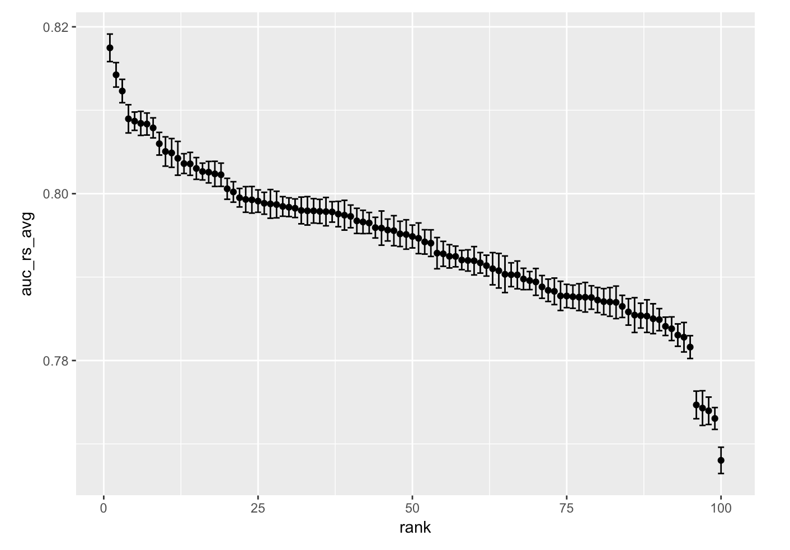
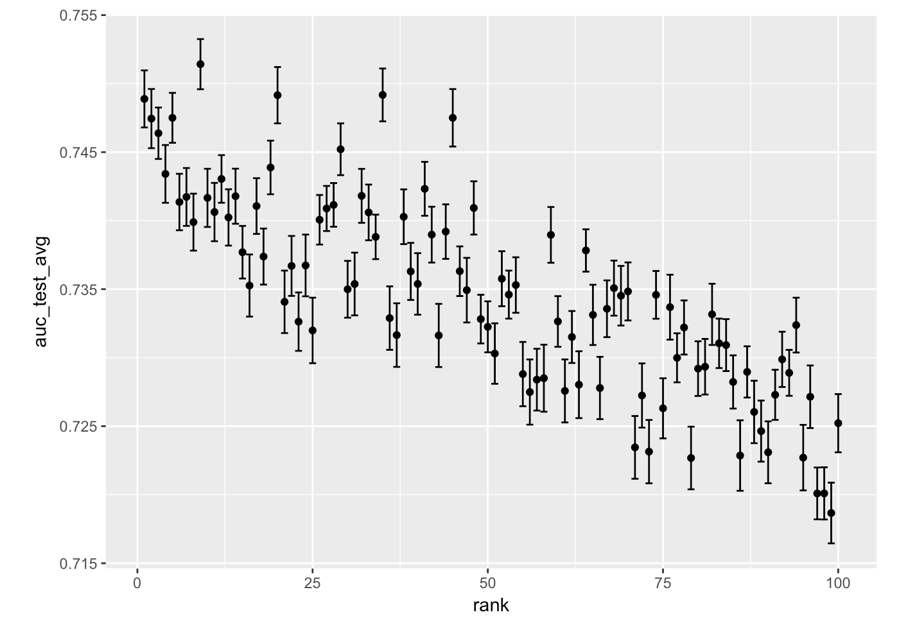
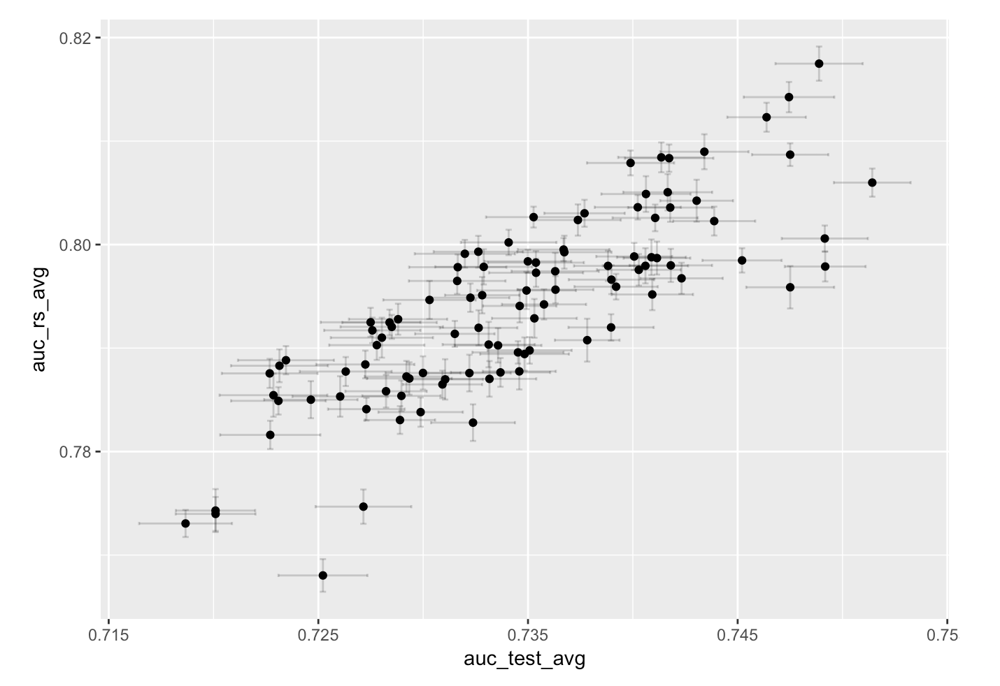
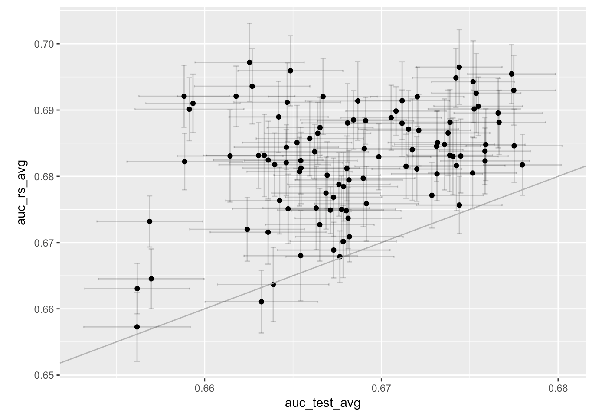
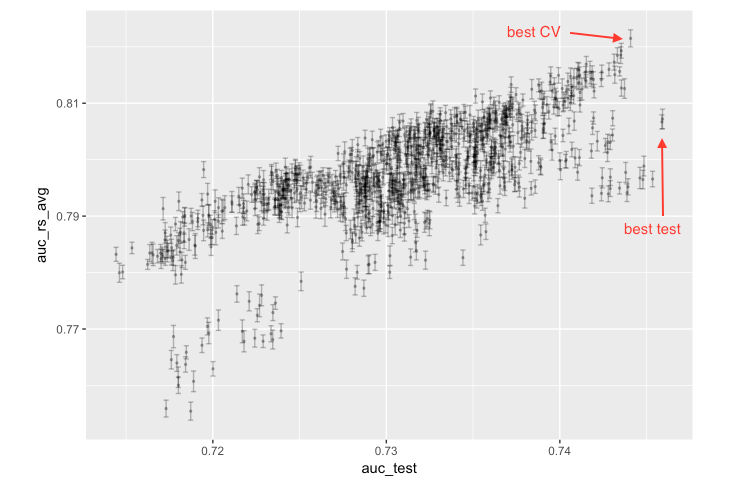
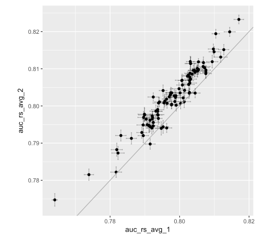
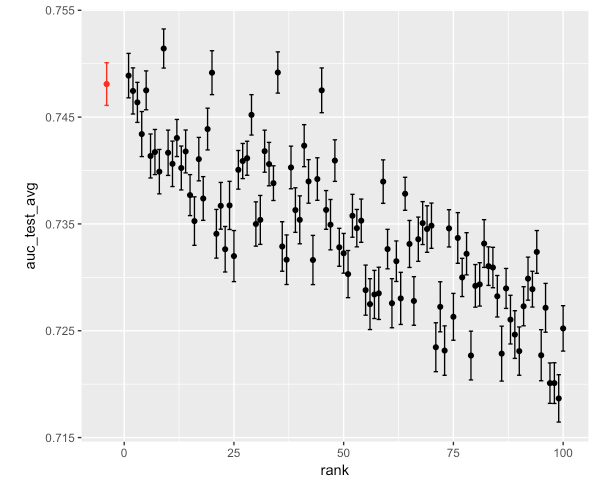

## Tuning GBMs (hyperparameter tuning) and impact on out-of-sample predictions

The goal of this repo is to study the impact of having one dataset/sample ("the dataset") 
when training and tuning machine learning models in practice (or in competitions) 
on the prediction accuracy on new data (that usually comes from a slightly different
distribution due to non-stationarity).

To keep things simple we focus on binary classification, use only one source dataset 
with mix of numeric and categorical features and no missing values, we don't perform feature engineering,
tune only GBMs with `lightgbm` and random hyperparameter search (might also ensemble the best models later), and 
we use only AUC as a measure of accuracy.

Unlike in most practical applications or in competitions such as Kaggle, we create the following
laboratory/controlled environment that allows us to study the effects of sample variations in repeated 
experiments. We pick a public dataset that spans over several years (the well known airline dataset).
From this source data we pick 1 year of "master" data for training/tuning and the following 1 year for testing (hold-out).
We take samples of give sizes (e.g. 10K, 100K, 1M records) from the "master" training set and 
samples of 100K from the "master" test set. 

We choose a grid of hyperparameter values and take 100 random combinations from the grid.
For each hyperparameter combination we repeat the following resampling procedure 20 times:
Split the training set 80-10-10 into data used for (1) training (2) validation for early stopping
and (3) evaluation for model selection. 
We train the GBM models with early stopping and record the AUCs on the last split of data (3). We record 
the average AUC and its standard deviation.
Finally, we compute the AUC on the testset for the ensemble of the 20 models obtained
with resampling (simple average of their predictions).

We study the test AUC of the top performing hyperparameter combinations (selected based only on 
the information from the resampling procedure without access to the test set). In fact, we resample
the test set itself as well, therefore we obtain averages and standard errors for the test AUC.


### Train set size 100K records 

The evaluation AUC of the 100 random hyperparameter trials vs their ranking
(errorbars based on train 80-10-10 resampling):



The test AUC vs evaluation ranking (errorbars based on testset resampling):



Test vs evaluation AUC (with errorbars based on train 80-10-10 and test resampling, respectively):



The top models selected by evaluation AUC are also top in test AUC, the correlation between
evaluation/model selection AUC and test AUC is high (Pearson and rank correlation `~0.75`).

A top model is:
```
num_leaves = 1000
learning_rate = 0.03
min_data_in_leaf = 5
feature_fraction = 0.8
bagging_fraction = 0.8
```

For this combination, early stopping happens at `~200` trees in `~10 sec` for each resample (on a server with 16 cores/8 physical cores) 
leading to evaluation AUC `0.815` and test AUC `0.745` (the training data is coming from one given year, while the test
data is coming from the next year, therefore the decrease in prediction accuracy).

The runtime and number of trees for the different hyperparameter combinations vary, the total training time
for the 100 random hyperparameter trials with 20 train resamples each is `~6 hrs`, while adding prediction time 
for 1 test set (initially) we have `~7 hrs` total runtime, while further on 20 resamples of the test set `~26 hrs`
total run time (the experiment can be easily parallelized to multiple servers as the trials in the random
search are completely independent).

More details [here](https://htmlpreview.github.io/?https://github.com/szilard/GBM-tune/blob/master/2-train_test_1each/analyze-100K-100.html) and
[here](https://htmlpreview.github.io/?https://github.com/szilard/GBM-tune/blob/master/3-test_rs/analyze-100K.html).


### Train set size 1M records 

The correlation between evaluation/model selection AUC and test AUC is even higher (Pearson/rank correlation `~0.97`),
and naturally the top models selected by evaluation AUC are also top in test AUC even more so.

The best models have now a larger `num_leaves` (as one would expect since there is more data and one can build deeper
trees without overfitting) and the early stopping stops later (more trees).
Rune time is approximately `10x`, best evaluation and test AUC in the table below.


Size    |  eval AUC      |  test AUC     | 
--------|----------------|---------------|
10K     | 0.701 / 0.682  | 0.660 / 0.670 |
100K    |   0.815        |   0.745       |
1M      |   0.952        |   0.847       |

More details [here](https://htmlpreview.github.io/?https://github.com/szilard/GBM-tune/blob/master/2-train_test_1each/analyze-1M-100.html).


### Train set size 10K records 

The best models selected based on evaluation AUC are not anymore the best models on test, the correlation is now low `~0.25`.



It seems 10K is just *not enough data* for obtaining a good model out-of-sample 
(some of the variables have 100s of categories and some appear with low frequency,
so this result is not completely unexpected), 
and even with cross validation there is some kind of *overfitting* here. 

The best models based on evaluation AUC have deeper trees (evaluation AUC `0.701`, but low test AUC `0.660`), while
the best models on test have shallower trees (evaluation AUC `0.682`, test AUC `0.670`).
Therefore one could reduce overfitting by restricting the space to shallower trees (effectively regularizing).

Also, the above evaluation AUC is a biased estimate for the AUC of the best model even on the training set (thanks @preko for
pointing this out). 

More details [here](https://htmlpreview.github.io/?https://github.com/szilard/GBM-tune/blob/master/2-train_test_1each/analyze-10K-100.html) and
[here](https://htmlpreview.github.io/?https://github.com/szilard/GBM-tune/blob/master/3-test_rs/analyze-10K.html).


### Note on train set sizes

...


### Larger hyperparameter search (1000 random trials)

We ran 1000 random trials on 100K data (~60 hrs runtime on 8 physical core server, one could parallelize the trials on different servers/more cores).



With these many trials the best model (cross-validation) is a bit overfit to the training set and it is not the best model on the test set.

Trials  |  eval AUC      |  test AUC     | 
--------|----------------|---------------|
100     |   0.815        |   0.745       |
1000    | 0.821 / 0.807  | 0.744 / 0.746 |

The best model on the test set (you cannot do that for model selection!!!) is also a bit overfit to the test set. If one does multiple
resamples of the test set (which we did not do here because of the extra computational costs), the best model on the "average" test set
would still be (slightly) overfitted to the test distribution (since that's likely to be a bit different than the train distribution
because of temporal separation).

More details [here](https://htmlpreview.github.io/?https://github.com/szilard/GBM-tune/blob/master/2-train_test_1each/analyze-100K-1000.html).


### Variation of best model selected vs training sample

We repeat the above experiments with resampling the train set from the source data. This is to study
the sensitivity of the results w.r.t. a given sample. 

For 100K records, the resample AUC for 2 train resamples with the same hyperparameter values:



The correlation (both Pearson and rank) of the 2 above is `~0.95`.

A similar graph and correlation is found if one looks at AUC on the test data. 

More details [here](https://htmlpreview.github.io/?https://github.com/szilard/GBM-tune/blob/master/4-train_rs/analyze.html).

Therefore, it seems that 100K records is enough to get similar best hyperparameter values 
not depending too much of the given training sample. However, the test AUC shows some
variation therefore the best models must be somewhat different. TODO: More reaserch to clarify this.


### Ensembles 

The test AUC of the average of the top 10 models (of the 100 with random hyperparameter search, selected based on
resample AUC) (in red) and the AUC of all the models (horizontal axis `rank` based on resample AUC):



More details [here](https://htmlpreview.github.io/?https://github.com/szilard/GBM-tune/blob/master/5-ensemble/analyze.html).

Interesting that this simple ensemble does not beat the best model.
TODO: Stacking or some other more sophisticated way of ensembling models (vs simple average of top 10 above).

